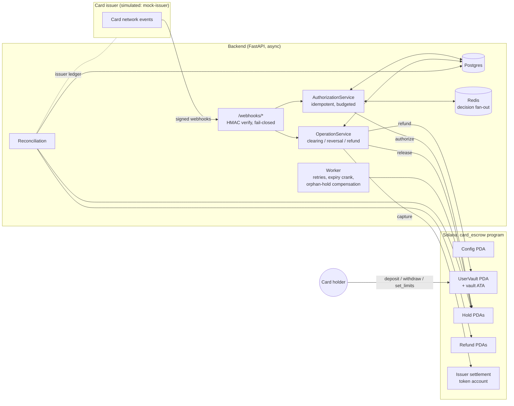
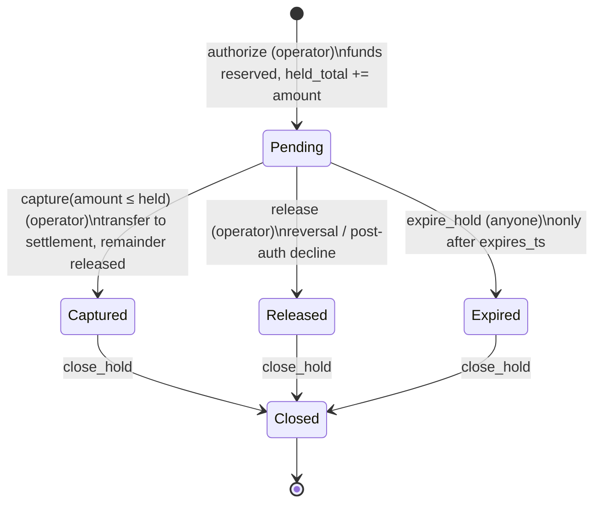

# card-escrow

**Non-custodial escrow for crypto card top-ups with authorization holds** — an
Anchor program on Solana plus a Python/FastAPI backend that simulates a card
issuer integration (authorization, clearing, reversal and refund webhooks).

> **Reference implementation.** The card issuer is simulated (`mock-issuer`).
> This is not a live card program, has not been audited, and no real cards are
> connected to it. Use it to study the design, not to hold other people's money.

<!-- STATUS:BEGIN -->
| | |
|---|---|
| Program ID | `8PyM1gDSssAqmn1qNPcwQ2y6nxFjUGwhPp81obhmAwpK` |
| Devnet | deployed — [explorer](https://explorer.solana.com/address/8PyM1gDSssAqmn1qNPcwQ2y6nxFjUGwhPp81obhmAwpK?cluster=devnet); mock-issuer E2E + reconciliation run against it |
| Mainnet | not deployed |
| Program tests | 66 passing (14 unit, 18 lifecycle, 34 security; LiteSVM against the SBF binary) |
| Backend tests | 98 passing (92 unit/service + 6 chain integration on devnet) |
<!-- STATUS:END -->

---

## Why

Crypto cards usually work by *pre-funding*: the user sends stablecoins to the
issuer, and the issuer spends them when the card is used. Between top-up and
spend, the issuer has custody. This project keeps user funds in a vault
that **only the user can withdraw from**, and gives the issuer exactly the
power a card network needs: *reserve* funds when a payment is authorized, and
*collect* them when it clears — nothing more.

## Architecture



### On-chain accounts

| Account | Seeds | Purpose |
|---|---|---|
| `Config` | `["config"]` | admin, operator, mint, settlement token account + authority, `paused`, default hold TTL |
| `UserVault` | `["vault", owner]` | `held_total`, daily limit window, velocity window. Its ATA holds the tokens |
| `Hold` | `["hold", vault, auth_id]` | amount, captured amount, status, created/expiry timestamps |
| `Refund` | `["refund", vault, refund_id]` | exists only to make refunds idempotent |

The program uses `anchor_spl::token_interface`, so it works with classic SPL
Token and Token-2022. Token-2022 mints with extensions that would break the
accounting or custody model (transfer fees, transfer hooks, permanent
delegate, non-transferable, confidential transfers) are rejected at
`initialize_config`.

### Instructions

| Instruction | Signer | Notes |
|---|---|---|
| `initialize_config` | program upgrade authority | prevents front-running the deployment |
| `update_config`, `set_paused` | admin | mint is immutable |
| `open_vault`, `deposit`, `withdraw`, `set_limits` | vault owner | `withdraw` never checks `paused` |
| `authorize(auth_id, amount)` | operator | `init` on the Hold PDA ⇒ duplicate `auth_id` fails |
| `capture(amount)` | operator | `amount ≤ hold.amount`; the remainder is released |
| `release` | operator | reversal / decline after authorization |
| `expire_hold` | **anyone** | only once `now ≥ expires_ts` |
| `refund(refund_id, amount)` | settlement authority | `init` on the Refund PDA ⇒ idempotent |
| `close_hold` | operator | final holds only; rent goes back to the original payer |

Every state change emits an event; all arithmetic is checked; every account
is constrained by seeds, `has_one`, `address`, or token constraints.

## Non-custodial guarantees

**The operator (issuer backend key) can:**
- reserve up to the vault's *available* balance (`balance − held_total`) per
  authorization, within the limits **the user** set;
- move held funds to **the configured settlement account** only, and only up
  to the held amount, before the hold expires;
- release holds.

**The operator cannot:**
- withdraw or transfer user funds anywhere else — capture's destination is
  pinned to `config.settlement_token_account`;
- change a user's limits (`set_limits` is owner-only);
- keep funds locked: every hold has an expiry and `expire_hold` is
  permissionless — the user (or anyone) can free the funds after the TTL;
- capture an expired, released or already-captured hold, or capture twice.

**The admin can** rotate the operator / settlement account, change the default
TTL of *future* holds, and pause. **The admin cannot** touch vault funds,
change the mint, or block withdrawals: `withdraw` does not read `paused`.

**Pause** blocks `authorize`, `capture` and `deposit` (no new value flows into
or out of the system). `withdraw`, `release`, `expire_hold` and `refund` keep
working because they only return value to users.

**Residual trust**, stated plainly: USDC's issuer can freeze token accounts; a
compromised operator key can capture *currently held* amounts into the
issuer's settlement account (bounded by the user's limits and holds, and
visible on-chain); the program upgrade authority can change the code — see the
upgrade authority plan below.

## Authorization lifecycle



Daily limit: sum of authorized amounts in a 24 h window that starts at the
first authorization after the previous window ended. Released/expired holds
and the unused part of a partial capture give their amount back to the
current window. Velocity: number of authorizations per configurable window
(not refunded by releases).

## Idempotency

**On-chain.** `auth_id` and `refund_id` are PDA seeds and the instructions use
`init`, so a duplicate fails at account creation (`AccountAlreadyInUse`) before
any state changes. A hold can leave `Pending` exactly once, so capture/release
retries cannot double-move funds. Issuer ids are mapped to seeds with
`sha256("card-escrow:auth:" + id)` (namespaced, fixed size, not in clear text).

**Off-chain (backend).**

1. **Authorization** — `authorizations.auth_id` is `UNIQUE`. The first request
   inserts the row (short transaction), reads the vault at *confirmed*
   commitment (slot stored with the snapshot), pre-checks balance/limits,
   sends `authorize` and **waits for confirmation**, then writes the decision
   with a compare-and-set (`WHERE decision IS NULL`, and for approvals
   `AND clock_timestamp() <= deadline_at`). Duplicates — sequential or
   concurrent — never recompute: they wait (Redis wake-up, DB polling
   fallback) and return the stored response **byte for byte**. If the
   issuer's budget (`ESCROW_AUTH_TIMEOUT_BUDGET_MS`, default 1500 ms) runs
   out, the request declines with `timeout`, persisted through the same CAS —
   so there is never more than one answer per `auth_id`.
2. **Clearing / reversal / refund** — `UNIQUE (kind, external_id)`; a lease
   (`processing` + `lease_until`) ensures one executor; final responses are
   stored and replayed; transient failures go to `retry` (HTTP 202) for the
   worker. "Already done" chain errors are resolved by reading the on-chain
   hold/refund state, and only for retries of the *same* operation.

## Failure modes

| Failure | Handling |
|---|---|
| Invalid / missing / stale webhook signature | 401, nothing parsed or stored (fail-closed) |
| RPC down or slow during authorization | decline `chain_unavailable` / `timeout` |
| Authorize tx lands **after** we declined (timeout, crash) | row flagged `compensation=pending`; worker releases the hold once seen, or marks `not_needed` after the blockhash landing window |
| Two authorizations race for the same balance | program is the arbiter: the loser fails preflight and is declined `insufficient_funds` |
| Backend crashes after claiming an auth | duplicates settle it as `timeout` decline once the deadline passes |
| Capture confirmation lost | retry hits `HoldNotPending`; on-chain `captured_amount` proves the earlier attempt landed |
| Late presentment (clearing after hold expiry) | capture rejected `hold_expired`; surfaced to issuer as failed |
| Operator disappears | users withdraw unheld funds anytime; holds expire permissionlessly |
| Redis down | waiters fall back to DB polling; correctness only depends on Postgres |
| DB / chain / issuer disagree | reconciliation reports every mismatch class (below) |

Reconciliation checks: `decision_mismatch`, `approved_without_hold`,
`orphan_hold`, `state_mismatch`, `hold_amount_mismatch`,
`captured_amount_mismatch`, `issuer_clearing_mismatch`,
`issuer_reversal_not_applied`, `cleared_declined_authorization`,
`missing_in_backend`, `refund_chain_mismatch`, `refund_issuer_mismatch`.

## Running locally

Requirements: Docker (with compose v2), [uv](https://docs.astral.sh/uv/).
The Solana toolchain runs in a pinned container (Agave 3.1.14, Anchor 1.2.1,
Rust 1.91.1), so the host OS does not matter.

```bash
# keypairs live outside the repo
mkdir -p ~/.config/solana/card-escrow   # deployer/operator/settlement keys are created on first bootstrap

# 1. program: build + tests
scripts/tc.sh anchor build
scripts/tc.sh cargo test -p card-escrow

# 2. local validator with the program preloaded
scripts/localnet.sh start

# 3. backend
cd backend
docker compose up -d                     # Postgres :5433, Redis :6391
export UV_PROJECT_ENVIRONMENT=~/.cache/card-escrow-venv
uv sync
uv run alembic upgrade head
uv run pytest                            # unit + service tests
uv run escrow-backend bootstrap --cluster localnet --out /tmp/localnet.json
ESCROW_IT_BOOTSTRAP=/tmp/localnet.json uv run pytest -m integration

# 4. end to end
export ESCROW_MINT=$(jq -r .ESCROW_MINT /tmp/localnet.json)
uv run escrow-backend register-card card_alice $(jq -r '."CARD:card_alice"' /tmp/localnet.json)
uv run escrow-backend register-card card_bob   $(jq -r '."CARD:card_bob"'   /tmp/localnet.json)
uv run escrow-backend serve &
uv run escrow-backend mock-issuer --card card_alice --limited-card card_bob --ledger ledger.jsonl
uv run escrow-backend reconcile --ledger ledger.jsonl
```

## Test coverage

**Program** (`scripts/tc.sh cargo test -p card-escrow`, 66 tests)

- `src/state.rs` — 14 native unit tests of the money logic: reservation
  against the available balance, daily-limit and velocity-window rollover,
  zero limits freezing the card, capture/release/expire rules, TTL bounds,
  overflow.
- `tests/test_lifecycle.rs` — 18 LiteSVM tests that load the built
  `card_escrow.so`: config init and role rotation, open vault / deposit /
  withdraw, limits, authorize → full and partial capture, release, expiry by
  anyone after the TTL, refund, closing holds, pause, a full Token-2022 card
  lifecycle.
- `tests/test_security.rs` — 34 negative tests: replayed auth and refund ids,
  capture above the hold or after expiry, early expiry, withdrawing held
  funds, limit boundaries, pause, every instruction with the wrong role
  (admin / operator / owner / upgrade authority), foreign vault and hold
  combinations, wrong mints, Token-2022 mints with a permanent delegate,
  `u64::MAX` amounts.

**Backend** (`uv run pytest --cov`, 98 tests, 75 % line+branch coverage)

| Area | Tests | Coverage |
|---|---|---|
| Authorization decisions, idempotency, timeout budget | `test_authorizations.py`, `test_decision.py` | 98–100 % |
| Clearing / reversal / refund operations | `test_operations.py` | 97 % |
| Worker (retries, expiry crank, orphan-hold compensation) | `test_worker.py` | 85 % |
| Three-way reconciliation | `test_reconcile.py` | 95 % |
| Webhook HMAC, API | `test_webhook_auth.py`, `test_api.py` | 90–100 % |
| Instruction encoding / account decoding | `test_program_client.py` | 100 % |
| `RpcGateway` against a real cluster | `test_integration_chain.py` (`-m integration`) | 92 % |

The uncovered remainder is operator tooling exercised by hand rather than by
pytest: `bootstrap.py`, `cli.py` and the `mock-issuer` itself.

**End to end on devnet.** The mock issuer runs 11 flows (full and partial
capture, reversal, refund with a duplicate delivery, sequential and concurrent
duplicate authorizations and clearings, insufficient funds, daily limit, a hold
left to expire, a forged signature, a clearing for an unknown authorization).
`escrow-backend reconcile` then compares the issuer ledger, the DB and the chain.
After two full runs: 30 authorizations and 3 refunds checked, 0 mismatches.

On the public devnet RPC (`api.devnet.solana.com`) an authorization
occasionally misses its budget because `getSignatureStatuses` is rate-limited
(HTTP 429). That is the designed failure mode, and the run shows it working:
the backend declines (fail-closed), the hold lands on chain a moment later, the
worker releases it as an orphan (`worker.orphan_hold_released`), and
reconciliation stays clean. In the last full run this hit the `reversal`
flow (10/11 passed); run on its own, that flow passes. Use a dedicated RPC for
anything beyond a demo.

## Deployments

### Devnet

| | |
|---|---|
| Program | [`8PyM1gDSssAqmn1qNPcwQ2y6nxFjUGwhPp81obhmAwpK`](https://explorer.solana.com/address/8PyM1gDSssAqmn1qNPcwQ2y6nxFjUGwhPp81obhmAwpK?cluster=devnet) |
| ProgramData | `5pAGGdZUMWY6LxguFrotqAUPipkTRMUXPWzP9AbkUxYk` (415 280 bytes, slot 508400601) |
| Upgrade authority | `7y5DrhLP9cBTUg4bLkQb35bxndyTY6K3FSGNTPYt2PyJ` |
| Config PDA | `4i9JsD6ynYg6ik2c3LHGcKWhcczRTcpizqUppCdhoGBb` |
| Test mint (6 decimals, not USDC) | `8MoGqRKufpjLVh9CupJabohLu7FTdAcFK7YaWQRdFFdy` |
| Demo vault: alice (1 000 tokens, 500/day) | owner `9XhsAuVUioZpC3N9PX1PqkCjfRdWApeycvn4fybb7wdz`, vault `6uQrE3scwEC8ps9RnUj12ke3im6xD48GmKhpYL9F44MT` |
| Demo vault: bob (50 tokens, 10/day) | owner `3P3ZxMMECo85uhUVMezoguahpkdJUZXZdmmQPHbAYHvL`, vault `9ppmvWmexbG6TQu3YKQQzxigNJBuEfyUPsSuN6HsviFm` |

Reproduce against devnet (the public RPC is rate-limited, so poll and decide
more slowly than on localnet):

```bash
uv run escrow-backend bootstrap --cluster devnet --rpc-url https://api.devnet.solana.com \
  --out ~/.config/solana/card-escrow/devnet/bootstrap.json
export ESCROW_RPC_URL=https://api.devnet.solana.com \
       ESCROW_AUTH_TIMEOUT_BUDGET_MS=8000 ESCROW_CONFIRM_POLL_S=0.8 ESCROW_WORKER_INTERVAL_S=15
# then step 4 above with the devnet bootstrap file and `mock-issuer --auth-timeout 10`
```

### Mainnet

Not deployed: it needs explicit sign-off and real SOL. The ProgramData account
for the 415 KB binary holds 2.11 SOL of rent on devnet, and mainnet rent is the
same. A deploy also needs a buffer of the same size for a while, which is
refunded afterwards. Build with `solana-verify` so the binary can be checked, and
run `bootstrap --mint <USDC>` so no test tokens are minted.

## Repository layout

```
programs/card_escrow/      Anchor program
  src/state.rs             accounts + pure money logic (unit-tested natively)
  src/instructions/        admin, vault, hold, refund
  tests/                   LiteSVM integration tests against the SBF binary
backend/                   FastAPI service, Alembic migrations, mock issuer
docker/toolchain.Dockerfile  pinned Solana/Anchor toolchain
scripts/                   tc.sh (run in toolchain), localnet.sh
idl/                       generated IDL
```

## License

MIT
